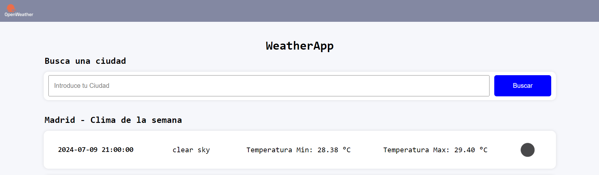

# WeatherApp
WeatherApp es una aplicación diseñada para buscar el tiempo de la semana de cualquier ciudad del mundo. La aplicación devuelve respuestas cada 3h los siguientes 5 días, indicando las temperaturas min y max, una breve descripción del tiempo previsto y el icono correspondiente. Esta aplicación está basada en React y utiliza useState para el input y useEffect para realizar la petición fetch a la API de OpenWeather
[OpenWeather](https://openweathermap.org/forecast5")

## Objetivos
- ✅ **Diseño del Frontend con React:** construcción del proyecto con Vite y estructura de carpetas por componentes.
- ✅ **UseState:** uso del UseState para capturar el submit del input y renderizar el tiempo de la ciudad buscada.
- ✅ **UseEffect:**  uso del UseEffect para realizar las peticiones fetch a la API.
- ✅ **Despliegue:** Despliegue de la aplicación en Render.

## Tecnologías
- ⚙️ **Frontend:** React, JSX, CSS.
- ⚙️ **Cloud:** Render.

## Estructura de carpetas y archivos
- node_modules/: Contiene las dependencias del proyecto instaladas con npm.
- public/: Carpeta para archivos estáticos públicos.
- src/: Carpeta principal del código fuente del proyecto.
    - assets/: Carpeta para recursos estáticos como imágenes, fuentes, etc.
    - components/: Carpeta que contiene los componentes reutilizables de la aplicación.
        - Footer/: Componente de pie de página.
        - Header/: Componente de encabezado.
        - Main/: Componente principal de la aplicación.
            - WeatherList/: Subcomponente que maneja la lista de clima.
            - WeatherCard/: Subcomponente que maneja cada tarjeta de clima individual.
    - App.css: Estilos globales para la aplicación.
    - App.jsx: Componente principal de la aplicación.
    - index.css: Estilos globales iniciales.
    - index.js: Punto de entrada de la aplicación.
    - main.jsx: Archivo principal para iniciar la aplicación.
- .eslintrc.cjs: Archivo de configuración para ESLint.
- .gitignore: Archivo para especificar qué archivos y carpetas deben ser ignorados por Git.
- index.html: Archivo HTML principal.
- package-lock.json: Archivo que mantiene un registro de las versiones exactas de las dependencias instaladas.
- package.json: Archivo de configuración del proyecto que contiene scripts y dependencias.
- README.md: Archivo de documentación del proyecto.
- vite.config.js: Archivo de configuración para Vite.